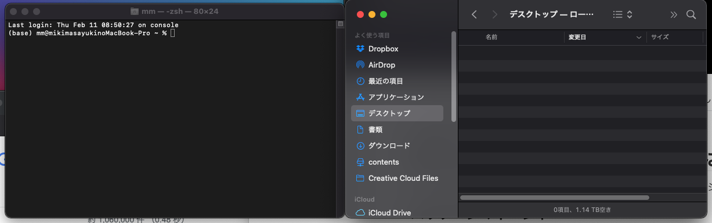

勉強会用資料

# Linuxとは

安全性の高いサーバ用のOSであるUNIXをベースに[**Linus Benedict Torvalds**](https://ja.wikipedia.org/wiki/%E3%83%AA%E3%83%BC%E3%83%8A%E3%82%B9%E3%83%BB%E3%83%88%E3%83%BC%E3%83%90%E3%83%AB%E3%82%BA)が作成したOSである。

# なぜLinuxがうけたか

- Linuxはベースとなるカーネルが無料であるにもかかわらず、高い安定性を誇り、サーバーOSとして利用出来るOSである。
- OS自体が非常に軽量で、GUI付きで展開しても10GB以内に収まることが多く、仮想OSとして最適である。
- C言語で書かれたシンプルな構成のため、開発がしやすい。
- UNIXのような堅牢さを誇りながら、無料で使えるディストリビューションが多い。

# ディストリビューション

Linuxは、カーネル部分はLinus氏が作成しているが、各企業が自身で使いやすいように様々な機能を持たせたものがあり、これらの違いをディストリビューションと言う。

# どんなディストリビューションがあるの

| 系統   | 名称                  | 特徴                                                         |
| ------ | --------------------- | ------------------------------------------------------------ |
| RedHat | RedHatEnterpriseLinux | 商用利用の標準。個人開発者は16システムまで無料。有料で利用すると結構高額 |
|        | CentOS                | RHELの無償版。ただし、最近開発体制が変わったので注意が必要。 |
|        | Fedora                | RHELが実験開発しているディストリビューション。無料。         |
| Debian | Debian                | フリー重視を謳っているディストリビューション。軽量で保守的な開発なので安定している。無料。 |
|        | Ubuntu                | おそらく現在のLinux市場において最大勢力のディストリビューション。AI開発や個人開発、Dockerのベースイメージ、WSL2で推奨される等、多種多様な使われ方をしている。無料 |

その他各社色々と開発されている。

# ディストリビューションの違いは？

メーカーが違う以外で個人利用の際に大きな違いは、パッケージマネージャが違うこと。

### パッケージマネージャ

特定のコマンドを入力することで、インターネット上にあるサーバからソースコードをダウンロードしてきてビルドして使えるようにするまでの一連の流れを簡単に行うことが出来るシステム。

| OS       | command             | Example                                             | Comment                                                      |
| -------- | ------------------- | --------------------------------------------------- | ------------------------------------------------------------ |
| RedHat系 | `yum`<br/>`dnf`     | `yum install python3`<br/>`dnf install python3`     | CentOS7までは`yum`が標準。                                   |
| Debian系 | `apt`<br/>`apt-get` | `apt install python3`<br/>`apt-get install python3` | Version 14以降は`apt`を推奨している。                        |
| Mac      | `brew`              | `brew install python3`                              | Appleが開発したわけではないが<br/>事実上標準的なパッケージマネージャ |
| Windows  |                     |                                                     | これといって有力なものがない。                               |

# どのディストリビューションを使えば

その時々で流動的だが、現在は**Ubuntu 20.04 LTS Server**を使えば良いと思われる。

> https://ubuntu.com/download/server

# Linuxの主なディレクトリ構成

| パス      | 内容                                                         |
| --------- | ------------------------------------------------------------ |
| /         | ルートディレクトリ                                           |
| **/bin**  | ここにメインのコマンドが入っている。                         |
| /boot     | システムに必要なファイルがある                               |
| /dev      | ハードウェアのデバイスファル                                 |
| /etc      | システム全体で使用する設定ファイル等                         |
| **/home** | ユーザー用ディレクトリ                                       |
| /lib      | カーネルとかプログラムのライブラリが入っている               |
| /media    | 外部ドライブとかのマウントで使われることが多い               |
| **/tmp**  | 一時的にファイルを保存しておきたいときに使ったりする。<br/>後々まで残すべきファイルは入れてはいけない |
| /mnt      | /mediaは常駐の外部ドライブとかに使い、こちらは臨時のマウントで使う |
| /sbin     | 権限をもったユーザのみ使用可能なプログラムが入っている       |
| /opt      | インストールされたアプリケーションとかが入るディレクトリ     |
| /proc     | カーネルが使用するディレクトリ。                             |
| /root     | スーパーユーザーが使ったりする                               |
| /sys      | カーネルの情報とかが入っている。                             |
| /usr      | OSにログインできるユーザー全てが使用できるアプリケーションを入れる<br/>ただし、インストールはスーパーユーザーが必要。 |
| /var      | 雑多に使う汎用ディレクトリ。                                 |

### ログインしたときのディレクトリ

スーパーユーザーの場合は`/root`もしくは、`/`がルートディレクトリになり、各ローカルユーザは`/home/ユーザ名`がルートディレクトリになることが多い。

### `~/`

`~/`は`/home/ユーザ名`ディレクトリを指している。

# GUIとCUI



### CUI

Character User Interfaceの略で、文字列を打ち込むことで意図する作業を行える。

### GUI

Graphical User Interfaceの略で、画面上でマウスを使ったりして意図する作業を行える。

### どちらを使うか

CUIを使うべき。理由は

- 作業内容は文字列なので、コピー・ペーストで同じ内容を再現可能。
- 上記に加え、作業内容を`.sh`ファイルとして作成して、そのまま実行が可能である。

# 実験用環境構築

## 仮想OS

今回は仮想OS上で動作させてみるので、VMWare Workstation(Macの場合はFusion)を使用する。

VMWare Workstationは、個人利用であれば無料で使うことが出来る。

### VMWareをインストール

下記URLからインストーラをダウンロードしてインストール。

> Windows
> https://www.vmware.com/jp/products/workstation-player/workstation-player-evaluation.html
> Mac(個人利用ライセンスの登録が必要)
> https://www.vmware.com/jp/products/fusion/fusion-evaluation.html

## isoファイルをダウンロード

ISOファイルとは、ディスクイメージをファイル化したものである。乱暴に言えばDVD-ROMをファイル化したもの。

> ubuntu server download
> https://ubuntu.com/download/server

## イメージ展開

1. `カスタム仮想マシン`を選択してして、新しく仮想マシン
2. 仮想マシンのOSを`Linux` -> `Ubuntu(64 bit)`で選択。
3. ブートファームウェアはどちらでも良いが、`UEFI`を使用する。
4. 仮想ディスクは`新しい仮想ディスクを作成`を選択。
5. `設定のカスタマイズ`を選択して、設定を変更する。ファイルを保存するダイアログが表示されたら適当な場所に保存する。
6. `プロセッサとメモリ`項目を適当に変更。
7. `ハードディスク`は必要分設定。
8. `CD/DVD(SATA)`を選択して、`自動検出`から、`ディスク・またはイメージ選択`を選ぶ。ファイル選択ダイアログが表示されるので、先程ダウンロードしたisoファイルを選択。また、`CD/DVDドライブを接続`にチェックを入れる。
9. 再生ボタンを押すと起動する。

## 初期設定

1. `ubuntu install server`を選択。
2. 言語設定は`English`
3. Keyboard Configurationは、`Layout:[Japanese]`、`Variant:[Japanese]`を選択。（キー配列が変わるので必ずJapaneseにする）矢印キーで下を押して行って`[Done]`を選択して進む。
4. `Network connections` 、次の`Configure proxy`、`Configure Ubuntu archive mirror`は大体何も変更しなくても`[Done]`を選択して良いが、環境によっては適宜変更して`[Done]`
5. `Guided storage configration`も変更せずに、矢印キーで下を押して行って`[Done]`を選択。
6. `Storage configration`も同じく変更せずに`[Done]`を選択すると、ディスク内の内容を消すけど良いかといった英文が表示されるので`[Continue]`を選択
7. `Your name`は名前（アカウントではない）、`Your server’s name`には、サーバー名を（例えばubuntuとか）、`Pick a username`には、ユーザー名を入力し`Choose a password`と`Confirm your password`には同じパスワードを入力して`[Done]`
8. SSH Setupは `[ ] Install OpenSSH server` にチェックを入れて`[Done]`
9. `Featured Server Snaps`は何も選択せずに`[Done]`
10. 各種インストールが始まり、終わると`[Reboot Now]`が表示されるので、それを選ぶ。
11. 再起動するとログイン画面になるので、先程入力した`Pick a username`の名前を入力して、passwordを求められるので設定したpasswordを入力してログイン

## その他設定

### スーパーユーザー

Linuxには、通常のユーザーの他に、高い権限を持つスーパーユーザーがある。ただ、Ubuntuにはデフォルトでは設定されていないので、以下のコマンドで設定が可能

```bash
sudo su -
passwd
```

# SSH接続をしてWindows(もしくはMac)上で仮想OSを操作してみる

仮想OSのIPアドレスを調べ、そのアドレス宛にホストOSからubuntuを操作してみる

### IPアドレスを調べる

仮想OS上で`ip a`と入力して、`192.168`から始まるIPアドレスを調べる。

### SSH接続をする

SSHとは、暗号化技術である。

windowsも、バージョン1803からOpenSSHを標準搭載しているらしいので、以下を実行

```bash
ssh user_name:password@192.168.xxx.xxx
```

なにか表示されたらyesを入力。passwordを入力してログイン出来る。

また、Visual studio codeにRemote SSHというプラグインがある。

# SUDO

## 試しにpyhon2をインストール

```bash
sudo apt install python
```

## sudoとは

先述のコマンドにある`sudo`とは、スーパーユーザーではないユーザーが、管理者権限でコマンドを実行するコマンドである。`apt`等の環境全体に影響のあるコマンドは、大体スーパーユーザー権限が必要なので、よく使うコマンドである。

# apt

先述したパッケージマネージャaptで以下をインストール

| コマンド                                    | 内容                                                         |
| ------------------------------------------- | ------------------------------------------------------------ |
| `sudo apt update`<br/>`sudo apt-get update` | リポジトリを更新                                             |
| `sudo apt-get -y install build-essential`   | 開発用のツールをまとめてインストール<br/>(`-y`は、インストールするかどうかを<br/>省略するオプション) |
| `sudo apt -y install docker.io`             | Dockerをインストール                                         |

# SFTP Client

SSH接続を使ったファイルのやりとりは、WindowsならWinSCPを使うと便利。

> https://forest.watch.impress.co.jp/library/software/winscp/

少しクセがあるが、Visual Studio CodeにもSFTPクライアントがあるので、こちらを利用するのも手だ。

# シェルとその系譜

コマンド入力のアプリケーション（シェル）そのものにもいくつかのバージョンや系列がある。

確認するには`echo "$SHELL"`と入力すると、どこに保存されているアプリケーションが使われているかを調べることが出来るので、そこから何が使われているかを調べることが出来る

例えば、`/bin/bash`と表示されている場合は`bash`が使われており、`/bin/bash --version`と入力すると、どのバージョンが使われているかがわかる。

ちなみに最近のMacはzshが使われている。

## 環境変数

環境変数とは、シェル内で使う変数である。

設定には`export 変数名=値`で設定が可能。

なお、`export`をつけない場合は、現在開いているシェルでしか使えないシェル変数になる。

## ログイン時にコマンドを実行する

ログインした際に、実行したい内容は、`.bash_profile`ファイル等を使う。

特によく使うのが、必ず使う環境変数を設定する時に使う。

# よく使うコマンド

| コマンド | 内容                                          | よく使う使い方    |
| -------- | --------------------------------------------- | ----------------- |
| ls       | ディレクトリの中身を確認                      | ls -l パス        |
| cd       | ディレクトリを移動                            | cd パス           |
| mv       | ファイルの移動と名前変更                      | mv パス1 パス2    |
| cp       | コピー                                        | cp パス1 パス2    |
| rm       | 削除(`-rf`をつけるとディレクトリごと消す)     | rm -rf パス       |
| cat      | ファイル内容を表示                            | cat パス          |
| vi       | テキストエディタで編集（`vim`というのもある） | vi パス           |
| mkdir    | ディレクトリ作成                              | mkdir -m 777 パス |
| chmod    | アクセス権を変更する。                        | chmod 777 パス    |

## 再起動

```bash
reboot
```

## シャットダウン

```bash
shutdown -h now
```

# 情報

## Server World

個人運営のサイトだが、Linuxの情報は大体このサイトかStackoverflowで足りることが多い。

https://www.server-world.info/

## stack overflow

FAQ形式の情報サイト。技術系の検索をすると１度はひっかかる

> https://stackoverflow.com/